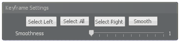
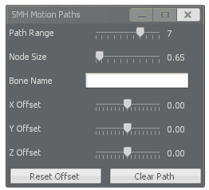

# Stop Motion Helper: Unofficial

This is the second part of the tutorial, which goes over the new features added for the unofficial Stop Motion Helper (SMH) 4.0. To summarize, these new features are the following:

- Animatable bonemerged entities (from the regular Bonemerger to the Composite Bonemerger to the Advanced Bonemerger),
- Audio playback to enable sound synchronization cues
- Motion paths to trace out the trajectory of a bone's path over time
- Additional modifiers for the entity editors and volume clouds
- New concommands to improve navigation over the timeline

Aside from that, it is uncertain if the official version will implement these features the same way as this fork implements them (particularly selecting bonemerged entities or audio playback). If the official version releases these features, please refer to their tutorials.

## User Interface

The UI in this version of SMH reflects the same version dated [at this time](https://github.com/Winded/StopMotionHelper/tree/8440b1a12613d5a481b184dbd0efc0569bb1f186), or similarly, to the workshop version around [February 2, 2022](https://steamcommunity.com/sharedfiles/filedetails/changelog/111895870). The only new additions are the following:

1. Keyframe Settings,
2. Audio playback, and
3. Motion Paths.

Although the keyframe settings float above the timeline, it is not moveable. However, the motion paths settings are moveable. Also note that one can access the motion path settings by navigating to the Settings button and clicking the button that says "Motion Paths" (between "Ghost transparency" and "Physics Recorder"). The audio playback user interface are new features added by the [SMG4 team](https://github.com/smg4tech/StopMotionHelper), from Version 0.1.0.

From the screenshot, we will introduce the new features, naturally stepping through the user interface from the left ot the right.

## Features

### Keyframe Manipulation and Navigation

This fork of SMH extends user's abilities to move through the timeline, adjust keyframe positions, and influence the effect of the animation. These can be done through the console, or through the readily available user interface. 

The first option is "Select All." As expected, this option will select all keyframes in the timeline. This circumvents the need to 1) select the first keyframe, 2) zoom or scroll to the right to find the ending keyframe, 3) select the final keyframe, and compresses the steps to do this into one (this saves two keystrokes). We can then manipulate these keyframes in any way, either by offsetting them to a different point on the timeline, deleting them all, or performing the smoothing operation.

In addition, the "Select All" feature acts as an invert operator. To explain, press "Select All" twice, and the keyframes will be deselected. The following video will illustrate another use case, which involves selecting a subsequence of keyframes in the timeline and the other keyframes.

https://github.com/user-attachments/assets/c9ace8da-7e25-4515-95a1-b4e99509e205

We mentioned earlier that we can **smooth** keyframes. This keyframe manipulation goes by different names, two of which I know: the arc method, and the Eltorro trick (see [this video](https://youtu.be/1DFOjr399Pk?t=45) for more information). We can perform this keyframe manipulation in two ways: the user interface, or with the concommand `smh_smooth n`, where `n` is a whole number indicating how much should be smoothed. This is known as the arc method because the output after performing the smoothing command is an arc, as seen in the following video. Notice the green motion paths in the smoothing trick has transformed from two straight lines into an arc. Also note the chat message indicating that smoothing has completed.

https://github.com/user-attachments/assets/de86fbd5-e1cb-4228-99dc-c4a901da08ac

In the video, we use the "Smoothness" slider to vary how much of an arc that we want. Smoothing adds an additional frame to the animation. If one starts off with one frame, smoothing will add an additional frame for a total of two frames: in general, if one begins with `n` frames, they end up with `n + 1` frames after a smoothing operation.

Smoothing can also be done with multiple selected frames, as seen in the next video.

https://github.com/user-attachments/assets/a8d6ac48-3177-4288-bb4b-5f11cfce5e88

The video also demonstrates some new navigation features in SMH. Like any console command, they can be binded them to a key or input button. They are summarized in the following table. Note that `n` is a whole number.

| Command Name        | Arguments | Description                                                                                                                                                      |
|---------------------|-----------|------------------------------------------------------------------------------------------------------------------------------------------------------------------|
| `smh_previous`      | `n`       | Move the playhead back by `n` frames.  If past 0, move the playhead to the end of the timeline.                                                                  |
| `smh_next`          | `n`       | Move the playhead forward by `n` frames.  If past the frame count, move the playhead to the beginning of the timeline.                                           |
| `smh_previousframe` | none      | Jump to the previous keyframe before the playhead.                                                                                                               |
| `smh_nextframe`     | none      | Jump to the next keyframe after the playhead.                                                                                                                    |
| `smh_zoom`          | `n`       | Set how many keyframes can be seen on the timeline. If the frame count is `n` and `smh_zoom` is set to `n`, then we will see exactly `n` frames on the timeline. |

### Audio Playback

The next set of UI enables audio playback. The four buttons on the timeline tab each open a window, where one can 1) explore the sound directory, 2) load an audio sequence, 3) save an audio sequence, and 4) manipulate the audio. In 4), grayed out buttons indicate that they will be implemented in the future. Also notice that audio sequences will also save the framerate and frame count, preserving them as they were at some point in the past.

If we insert an audio clip into the timeline in 1), and check "Edit Audio Track", we will be able to see the clip on the timeline. This clip gives us the length of the clip, and its waveform, indicating where in the clip is it the loudest. The length of the clip on the timeline is influenced by the framerate and how much the timeline has zoomed in or out (after importing engineer_taunts12.mp3, I executed `smh_zoom 500`). We can play the audio clip through `+smh_playback`, given that we disable smooth playback to ensure consistent audio playback.

We can then use 4) the Audio Clip Tools to manipulate this audio clip. To delete an audio clip, the playhead must be adjusted to the *beginning* of the audio clip (not somewhere in the middle, or at the end). We click on it twice to delete the audio clip (the first click will confirm if one is sure to delete the audio clip). Alternatively, if we wanted to delete all audio clips, we use "Delete All."

Audio clips are saved in the `garrysmod/data/smh/audio` folder. It is recommended to keep audio in this directory and animation files elsewhere.

### Selecting Bonemerged Entities

By default, Stop Motion Helper is capable of animating any entity, but it is not capable of selecting bonemerged entities. This fork adds two methods of selecting bonemerged entities, enabling one to animate a bonemerged prop. The following video illustrates two ways to select a bonemerged entity:

1. Right-click on the entity multiple times to cycle through an entity's bonemerged items, or
2. Select the bonemerged item through the properties menu.

https://github.com/user-attachments/assets/5c1edcf8-916c-46ff-8e18-1179492778d6

Once you have selected the bonemerged entity, you can start animating the bonemerged entity through a tool such as the Ragdoll Mover (RGM).

### Visualizing Bone Motion Paths

The last addition to the SMH UI is a window for modifying motion paths. In the earlier media on this tutorial, motion paths are shown as green circles, with green lines connecting between them. These green circles are keyframes, while the green lines show the path that the animated object will take. Yellow circles indicate the keyframe that the playhead is in. We can adjust how much of the trajectory we want to see with the "Path Range" slider. For reference, setting the slider to 1 will show two green circles immediately before and after the keyframe (as in Ghost Previous/Next frame); setting the slider to 2 will show four green circles, and 3 shows 6; in general, setting the slider to `n` will give us `2n` circles.

Finally, we can choose which bone to follow in the Bone Name text entry. Simply reference the bone that you want to follow (for instance, one can use Ragdoll Mover to identify), and type its name (it is case-sensitive!). This works for physical bones and nonphysical bones.

Alternatively, these settings can be changed in the console. The following table summarizes these console commands. Note that `n` is a whole number, `d` is a decimal-point number, and `string` can be a name.

| Command Name          | Arguments | Description                                        |
|-----------------------|-----------|----------------------------------------------------|
| `smh_motionpathbone`  | `string`  | Select the bone to view its trajectory             |
| `smh_motionpathrange` | `n`       | Restrict how many nodes on the motion path to view |
| `smh_motionpathsize`  | `d`       | Change the size of the nodes on the motion path.   |

### Miscellaneous

There are more features in this version that value an explanation. However, we have decided to omit this explanation by listing them down for you to explore. In addition to the aforementioned features,

- This fork adds more entities to animate: SMH can now animate GMod's default sun, sky, and fog editors. In addition, the fork also adds a modifier for [volumetric clouds](https://steamcommunity.com/sharedfiles/filedetails/?id=3195029892), allowing its parameters to be adjusted.
- This exit save feature allows the game to save your SMH animation when the server shuts down with players connected. Similarly, if a player leaves or reloads a map, they will automatically save their progress. Exit saves are found in the `garrysmod/data/smh` folder, named as `exit_save_NICKNAME_ID`, where `NICKNAME` is your Steam name (not username), and `ID` is your [account id](https://developer.valvesoftware.com/wiki/SteamID#:~:text=SteamIDs%20follow%20a,the%20%22account%20number%22).
- Framerate, frame count, and timeline length are now console variables, in the form of `smh_fps`, `smh_framecount`, and `smh_zoom`, respectively. The first two require whole number inputs, while zoom requires a decimal number (although it is saved as a whole number).
- The physics recorder now includes two more indicators to show that one is recording: a beeping sound akin to SFM during the countdown to record, and a red circle on the top right, which fades when nearing the end of the physics recording session.

## Other Resources

The features above were built to introduce workflows involving audio and animation synchronization, bonemerged entity animations, and arc-ed movements. The links take you to additional resources to help improve your animation process.

- [Precise Aim Vector](https://gist.github.com/vlazed/ae9e30bbecec14062689aeced6ea034d): This script increases the precision of your mouse cursor as seen by the server, which fixes jittering when you use the Ragdoll Mover gizmos with an unlocked cursor (via holding C or through other means).
- [Sync SMH Path Bone with RGM](https://gist.github.com/vlazed/72426266ef290773ecfbd97d164b8802): This script interfaces Ragdoll Mover with my fork of Stop Motion Helper to automatically rename the `smh_motionpathbone` when one selects a bone with Ragdoll Mover.
- [Catmull-Rom Camera SMH Interface](https://github.com/vlazed/Catmull-Rom-Cinematic-Cameras/tree/smh-interface): This is a modification of the [original addon](https://steamcommunity.com/sharedfiles/filedetails/?id=198542384) to allow one to bake a camera's spline path into a camera entity (standard or Advanced Camera).
- [Freeze Props on Spawn](https://gist.github.com/vlazed/a01f799f6290f533cdb65e900bcc032f): This script freezes props when they spawn. This also freezes props when you load a save. This is useful if, for some reason, your save does not keep props frozen (such as with effect prop assemblies). This is an alternative to using `phys_timescale 0`.
- [PenAkTools](https://github.com/penolakushari/PenAkTools): A collection of quality-of-life scripts for animation by PenolAkushari. The ones I use most often are the Macro Replacer ([my version with presets](https://github.com/vlazed/PenAkTools/blob/master/macroreplacement/lua/autorun/client/macroreplacerthing.lua)), the Fake Depth post-processing effect, and the Ragdoll Weight tool.  
